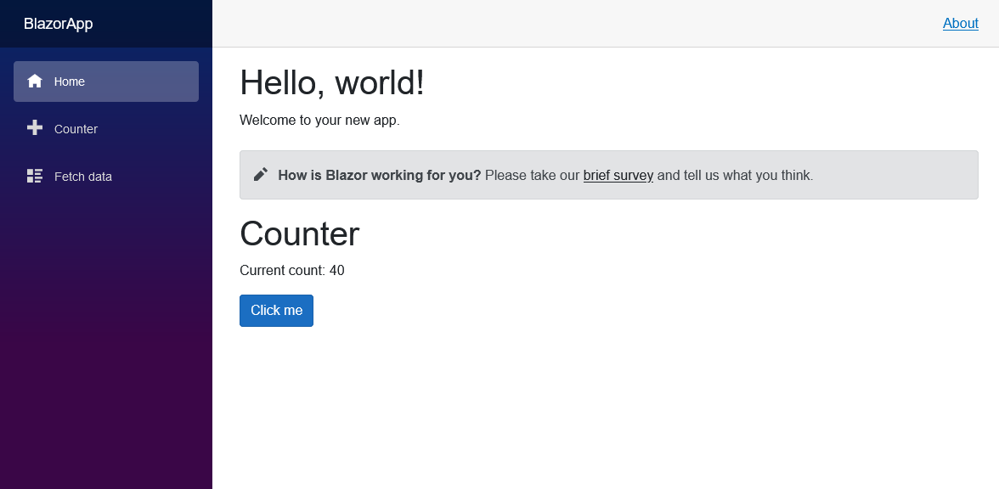
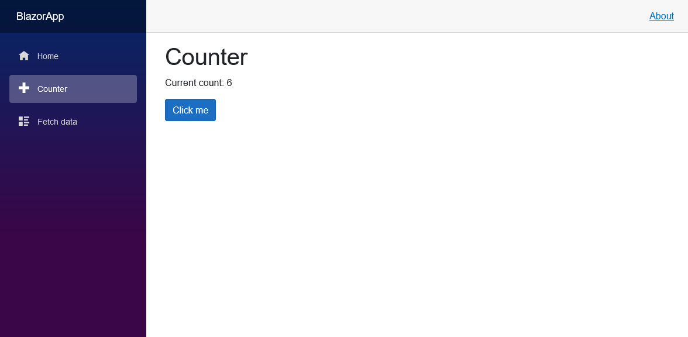
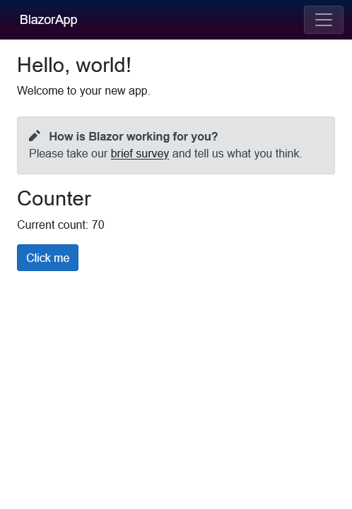
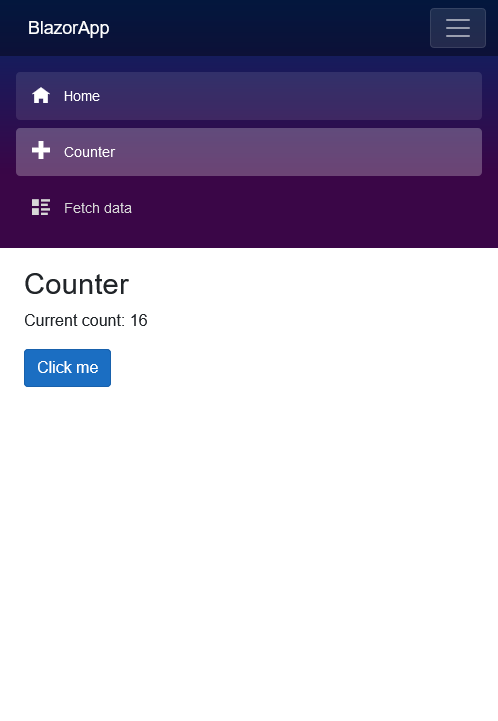

# 01-blazor-tutorial
Doing Blazar tutorial

# References

[[microsoft.com] Blazor Tutorial - Build your first Blazor app](https://dotnet.microsoft.com/en-us/learn/aspnet/blazor-tutorial/intro)

# Preparations

- Windows 10
- .NET 6.0
- [Git Client](https://git-scm.com/downloads) 

# How to view the website
- Launch web server
```
cd BlazorApp
dotnet watch
```
- Go to website address at `http://localhost:80`

# Expected output
## Terminal
```
dotnet watch 🔥 Hot reload enabled. For a list of supported edits, see https://aka.ms/dotnet/hot-reload.
  💡 Press "Ctrl + R" to restart.
dotnet watch 🔧 Building...
  Determining projects to restore...
  All projects are up-to-date for restore.
  BlazorApp -> C:\Users\ninehealth\work\9Health\dotnet\10-blazor-tutorial\BlazorApp\bin\Debug\net6.0\BlazorApp.dll
dotnet watch 🚀 Started
info: Microsoft.Hosting.Lifetime[14]
      Now listening on: http://[::]:80
info: Microsoft.Hosting.Lifetime[0]
      Application started. Press Ctrl+C to shut down.
info: Microsoft.Hosting.Lifetime[0]
      Hosting environment: Development
info: Microsoft.Hosting.Lifetime[0]
      Content root path: C:\Users\ninehealth\work\9Health\dotnet\10-blazor-tutorial\BlazorApp\
```
## Screenshots
### On PC





### On mobile






# Other Notes

## Somethings to try
* Try to change the `IncrementAmount` at Home page from `10` to `20`
* Look at the `dotnet watch` window to see Hot reload magic feature
* Try to change listening port to a different port
